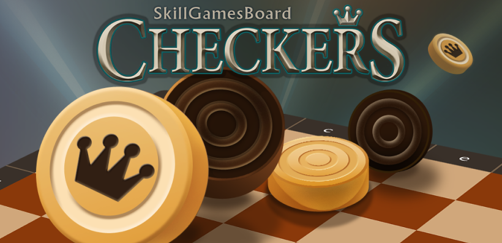

# Checkers 



Checkers is a classic board game implemented in a web environment using the Dojo Engine. This project leverages Starknet’s Layer 2 to create a fully decentralized, on-chain checkers game. All game logic, including player moves, validations, and win conditions, is implemented with smart contracts on Starknet, ensuring transparency and fairness.

- Create Burners
- Controller

## Prerequisites

Before you begin, ensure you have the following installed on your machine:

- **[Node.js](https://nodejs.org/)**
- **[pnpm](https://pnpm.io/)**
- **[Dojo v1.0.0-rc.1](https://book.dojoengine.org/)**

---

## Quick Start Guide

### Terminal 1: Start Katana

Open a terminal and run:

```bash
cd dojo-starter
katana --disable-fee --allowed-origins "*"
```

### Terminal 2: Build and Migrate the Project

In a second terminal, execute:

```bash
cd dojo-starter
sozo build
sozo migrate
torii --world 0x06171ed98331e849d6084bf2b3e3186a7ddf35574dd68cab4691053ee8ab69d7 --allowed-origins "*"
```

### Terminal 3: Start the Client

In a third terminal, navigate to the client folder and run:

```bash
cd client
pnpm i
pnpm dev
```

### Terminal 4: Start Full UI

In a quarter terminal, navigate to the the-marquis folder and run:

```bash
cd the-marquis
yarn install
yarn start
```

---

## Play

After completing the steps above, access the Checkers game by navigating to `http://localhost:5173` in your web browser.

---

## Notes

- Ensure all terminals are running in the background to maintain an active environment while you play.
- Feel free to modify the configurations and styles in the source code to personalize your gaming experience.

---
